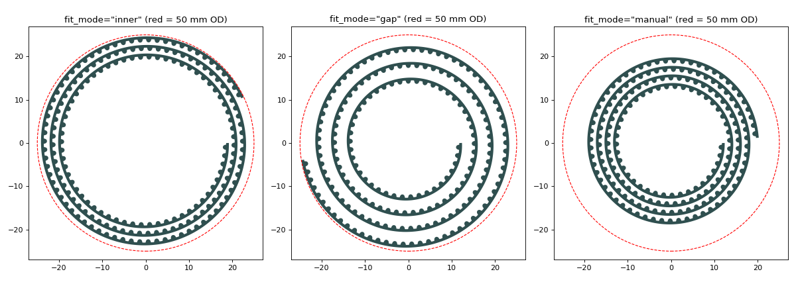

# GT2 Spiral Belt (OpenSCAD)

A parametric GT2 timing belt wound into an Archimedean spiral. You set the belt length and the overall spiral size, and the model keeps GT2 pitch and tooth shape.

## How it works

The straight GT2 profile is wrapped onto the spiral by exact arc length along the belt's **pitch line** (0.254 mm above the tooth land, per the GT2 pitch-line spec). Tooth centres stay exactly 2.000 mm apart along the pitch line, the same way a real belt keeps its pitch when it wraps a pulley.

The belt cross-section is standard GT2: 0.75 mm teeth on a 0.63 mm base, 1.38 mm total. The base thickness and tooth height are adjustable.

## Usage

Open `gt2_spiral_belt.scad` in OpenSCAD and use **Window › Customizer**.

| Parameter | What it does |
|---|---|
| `total_length` | Pitch length of the belt in mm, rounded down to whole 2 mm teeth unless `keep_partial` is on |
| `belt_width` | Belt width, which is the part height |
| `base_thickness` | Thickness of the flat base, from tooth land to belt back (GT2 standard is 0.63 mm). The teeth and pitch line don't change, so the belt still meshes with GT2 pulleys |
| `tooth_height` | Tooth height from land to tip (GT2 standard is 0.75 mm). Stretches the tooth vertically and keeps its width and the pitch. Values other than 0.75 won't mesh with standard GT2 pulleys |
| `outer_diameter` | Overall outside diameter of the spiral |
| `fit_mode` | `inner`: solve the start radius and keep the gap. `gap`: solve the gap between turns and keep the start radius. `manual`: ignore the diameter |
| `inner_radius` | Pitch radius where the spiral starts (`gap` / `manual`) |
| `turn_gap` | Air gap between turns (`inner` / `manual`) |
| `min_gap` | Minimum allowed gap, for print clearance |
| `teeth_inward` | Teeth face the centre (off: teeth face out) |
| `max_seg`, `tooth_resolution` | Smoothness of the spiral and the tooth arcs |

The console prints the tooth count, number of turns, solved radius and gap, and final diameter.

## Credits

- **Original design:** `gt2.scad` GT2 profile, belt and pulley library, © 2023 Alessandro Garosi (tdo_brandano@hotmail.com), LGPL-2.1-or-later.
- **Spiral version:** co-created by **Saad Chinoy** and **Stephane Godin**, 2026.

## License

GNU Lesser General Public License v2.1 or later. See [LICENSE](LICENSE).
